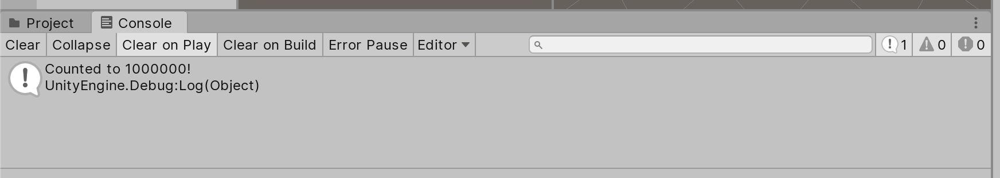

# Unity-TaskRunner
Run threaded tasks in unity.


Running long tasks in Unity can be fiddly, since a lot of Unity can not be accessed from outside the main thread.
Unity-TaskRunner makes stuff like this easier.

[Download Unity Package](https://github.com/manoadamro/Unity-TaskRunner/releases)
[See Examples](./Assets/Scripts/Tasks/Examples)


---

### Creating a Task

```csharp
var task = new TaskData<int, string>
{
    Title = $"Count to {countTo}",
    Action = MyTask,
    Arg1 = countTo,
    Callback = OnTaskComplete,
    Join = true
};

```


#### Title

String to display in the progress bar


#### Action and Args

Task methods must follow one of the following patterns:

- `TReturn MyTask (out TaskProgress progress)`

- `TReturn MyTask (TArg1 arg1, out TaskProgress progress)`

- `TReturn MyTask (TArg1 arg1, TArg2 arg2, out TaskProgress progress)`

- `TReturn MyTask (TArg1 arg1, TArg2 arg2, TArg3 arg3, out TaskProgress progress)`


The task can set the progress variable as and when it needs to.
This progress report will be available to other threads.

Eg:
```csharp
private string MyTask(int maximum, out TaskProgress progress)
{
    for (var i = 0; i < maximum; i++)
        progress = new TaskProgress(
            $"Counted to {i + 1} of {maximum}",
            (i + 1f) / maximum);

    progress = new TaskProgress("Done!", 1f);
    return $"Counted to {countTo}!";
}

```


Args (Arg1, Arg2, etc...) must also be populated in the initialiser.


#### Progress


Inside a task method, the progress can be reported. 
This will be shown in the loading bar if running in edit mode.

Progress is represented with an object taking a string description and a float value between 0 and 1 inclusive.

Eg: `progress = new TaskProgress($"Counted to {i + 1} of {maximum}", (i + 1f) / maximum)`


#### Callback and Join

A method taking a single parameter (`TReturn` from Action)

- `void MyTasksCallback(TReturn item)`


If join is `true`, the callback will be called from the main thread, this means you can take the output and use it with the Unity API with no issues.

If join is `false`, the callback is called from the thread and the Unity API is still unavailable.


Eg:
```csharp
private void OnTaskComplete(string outcome) => Debug.Log(outcome);
```


---


### Running a Task


```csharp
var taskRunner = GetComponent<TaskRunner>();

var task = new TaskData<int, string>
{
    Title = $"Count to {countTo}",
    Action = MyTask,
    Arg1 = countTo,
    Callback = OnTaskComplete,
    Join = true
};


taskRunner.RunTask(task);

```


`taskRunner.RunTask` can be run from any thread, the runner will handle this and ensure everything ends up on the right thread.





[See here](./Assets/Scripts/Tasks/Examples) for more examples.


---