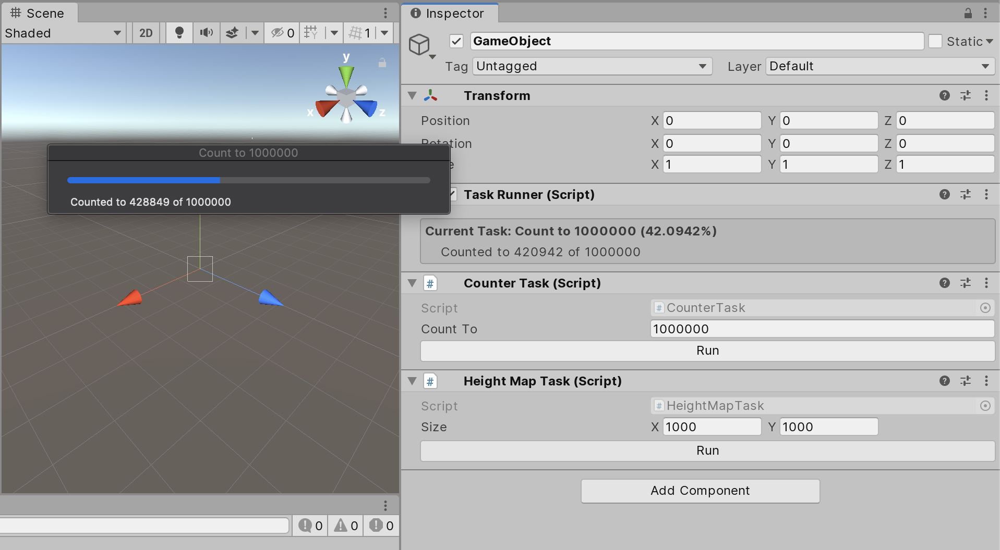

# Unity-TaskRunner
Queue and Run threaded tasks in unity.

- [See Examples](./Assets/Scripts/Tasks/Examples)
- [Download Unity Package](https://github.com/manoadamro/Unity-TaskRunner/releases)


## Quick Example

When running long tasks in the editor, 
it freezes and you get no information about what is happening.

This package allows you to run a method on a separate thread and have it callback to the main thread once it has finished, 
while reporting on it's progress the whole time.

For example. Let's say you want to generate a piece of terrain.
You will first need to generate a height map, then use it to create a mesh in the scene.

The first part does not require any interaction with unity, 
so it's safe to run that part on a separate thread, 
but creating scene objects must be done from the main thread.

The solution here would be to run `GenerateHeightMap` as a task, 
then use the callback to create the mesh.

```csharp

private float[,] GenerateHeightMap(Vector2Int mapSize, out TaskProgress progress)
{
    var heightMap = new float[mapSize.x, mapSize.y];
    var total = mapSize.x * mapSize.y;
    var counter = 0f;

    for (var y = 0; y < mapSize.y; y++)
    for (var x = 0; x < mapSize.x; x++)
    {
        heightMap[x, y] = Mathf.PerlinNoise(x, y);
        counter += 1f;
        progress = new TaskProgress(
            $"Created to {counter} of {total}",
            counter / total);
    }

    progress = TaskProgress.Done;
    return heightMap;
}
```

`GenerateHeightMap` is our task method. 
This is what will be run on a thread and as such, 
nothing within this method can interact with the unity engine.

Progress is reported incrementally by setting the `progress` variable with `TaskProgress` instance.


```csharp
private void OnHeightMapGenerated(float[,] heightMap)
{
    var meshData CreateMeshFromHeightMap(heightMap);
    RenderMesh(meshData)
}
```

`OnHeightMapGenerated` is the callback method.
This is called when the task is finished.

Assuming the task was created with the `Join` flag set true, 
this is called on the main thread and can interact with Unity with no issues.

The parameter `heightMap` is the return value of the task method. 
In this case, `GenerateHeightMap`.

```csharp
var task = new TaskData<int, string>
{
    Title = $"Generate {size.x}x{size.y} HeightMap",
    Action = GenerateHeightMap,
    Arg1 = new Vector2Int(100, 100),
    Callback = OnHeightMapGenerated,
    Join = true
};
```

This is the task initialiser. 
It packages all of the required information into an instance of `TaskData`, 
ready for the `TaskRunner`.

now we can pass the `TaskData` instance to a `TaskRunner`.

```csharp
taskRunner = GetComponent<TaskRunner>();
taskRunner.RunTask(task);
```

The task is now queued and will be executed on the next update cycle (editor or play mode).

This is what a task looks like as it is being executed:




Once the task has finished, the defined callback is called (in our case: `OnHeightMapGenerated`).

---

## Creating a Task

```csharp
var task = new TaskData<int, string>
{
    Title = $"Generate {size.x}x{size.y} HeightMap",
    Action = GenerateHeightMap,
    Arg1 = new Vector2Int(100, 100),
    Callback = OnHeightMapGenerated,
    Join = true
};
```

#### Title

String to display as title of the progress bar.
Other UI elements may also refer to this.

#### Action & Args

Task methods can take between 0 and 3 args, and are assigned here as `Arg1`, `Arg2`, etc, as necessary.
Types for these args are defined between the `<>`, with the last value being the return value.

Eg:

- `public string MyTask (out TaskProgress progress)` -> `new TaskData<string>`
- `public string MyTask (int a, out TaskProgress progress)` -> `new TaskData<int, string>`
- `public string MyTask (int a, bool b, out TaskProgress progress)` -> `new TaskData<int, bool, string>`
- `public string MyTask (int a, bool b, float c, out TaskProgress progress)` -> `new TaskData<int, bool, float, string>`


#### Callback & Join

The callback method has a return type of `void` and takes a single argument.
The argument type is the same as the return type from the task method.

If `Join` is true, 
the callback will be called from the main thread and it will be safe to interact with the unity engine.

If `Join` is false, the callback will be called from the same thread as the task ran on. 
This is useful if you don't intend to interact with unity in the callback. 
Eg, setting variables or running more tasks.  

## Running a Task

```csharp
taskRunner = GetComponent<TaskRunner>();
taskRunner.RunTask(task);
```

Instances of `TaskData` are passed to the `RunTask` method in a `TaskRunner` instance.
These tasks are then added to a queue and eventually executed.

## Reporting Progress

The final parameter in a task method is `out TaskProgress progress`.
This is used to report the progress of a task.

```csharp
progress = new TaskProgress{ Progress = 0.5f, Description = "The task is 50% complete" }
```

#### Progress

float value between 0 and 1 representing the overall progress of the task (0 = not started, 1 = finished).

#### Description

string to be displayed in the progress bar.

---
